# Webhook & Settings Refactoring - Implementation Walkthrough

## Overview

Successfully refactored the application architecture to centralize webhook URL configuration and improve the organization of Settings and Platforms pages.

## Changes Implemented

### 🔧 Backend Changes

#### [publisher.service.js](file:///Users/tervahagn/REPORSITORIES/Social%20Scheduler/backend/src/services/publisher.service.js)

**What Changed:**
- Webhook URL now fetched from `settings` table with key `make_webhook_url`
- Removed platform-specific webhook URL dependency
- Added clear error messaging when webhook not configured

**Key Changes:**
```javascript
// NEW: Get webhook from centralized settings
const webhookSetting = await db.prepare(
    "SELECT value FROM settings WHERE key = 'make_webhook_url'"
).get();
const webhookUrl = webhookSetting?.value;

if (!webhookUrl) {
    throw new Error('Make.com webhook URL not configured. Please add it in Settings → Make.com Webhook Integration.');
}
```

**Impact:**
- ✅ Single source of truth for webhook URL
- ✅ Clear error messages guide users to Settings
- ✅ Simpler database queries (no JOIN on webhook_url)

---

### 🎨 Frontend Changes

#### Settings Page - Complete Refactor

**Reorganized into clear sections:**

1. **OpenRouter Configuration**
   - API Key input (with show/hide toggle)
   - Model selection dropdown
   - Support for custom model IDs
   - Save button

2. **Make.com Webhook Integration** ⭐ NEW
   - Centralized webhook URL input
   - Clear description of single-webhook architecture
   - Icon-based UI for visual clarity

3. **Collapsible Guide Sections** ⭐ NEW
   - OpenRouter Guide (expandable/collapsible)
   - Webhook Setup Guide (moved from Platforms, expandable/collapsible)
   - Cleaner UI with reduced visual clutter

**Removed:**
- ❌ Master Prompt section (moved to Platforms page)

**New State Management:**
```javascript
const [showOpenRouterGuide, setShowOpenRouterGuide] = useState(false);
const [showWebhookGuide, setShowWebhookGuide] = useState(false);
```

**UI Features:**
- Collapsible guide sections with chevron icons
- Sticky right sidebar with guides
- Updated info box explaining new architecture
- Consistent styling and spacing

---

#### Platforms Page - Simplified & Enhanced

**New Master Prompt Section** ⭐
- Prominent card at top of page (before platform list)
- View/edit modes with syntax highlighting
- Save/cancel functionality
- Clear description of purpose

**Simplified Platform Cards:**
- ✅ Keep: Enable/disable toggle
- ✅ Keep: Platform-specific prompts (Main + Technical)
- ❌ Removed: Webhook URL fields entirely
- ❌ Removed: Webhook configuration UI

**Removed:**
- ❌ Webhook Setup Guide (moved to Settings)
- ❌ Right sidebar guide section

**Layout:**
```
┌─ Master Prompt Card (full width) ───────────┐
│ Edit/view toggle                            │
│ Syntax-highlighted prompt display          │
└─────────────────────────────────────────────┘

┌─ Platform Grid ─────────────────────────────┐
│ ┌─ Platform Card ─┐  ┌─ Platform Card ─┐  │
│ │ • Toggle        │  │ • Toggle        │  │
│ │ • Prompts       │  │ • Prompts       │  │
│ └─────────────────┘  └─────────────────┘  │
└─────────────────────────────────────────────┘
```

---

## Architecture Improvements

### Before
```
Platform 1 → Webhook URL 1 → Make.com
Platform 2 → Webhook URL 2 → Make.com
Platform 3 → Webhook URL 3 → Make.com
```
**Issues:** Duplication, confusion, maintenance overhead

### After
```
All Platforms → Single Webhook URL → Make.com Router → Individual Platforms
```
**Benefits:** Single source of truth, clearer architecture, easier maintenance

---

## File Changes Summary

| File | Type | Description |
|------|------|-------------|
| [backend/src/services/publisher.service.js](file:///Users/tervahagn/REPORSITORIES/Social%20Scheduler/backend/src/services/publisher.service.js) | Modified | Centralized webhook URL from settings |
| [frontend/src/pages/Settings.jsx](file:///Users/tervahagn/REPORSITORIES/Social%20Scheduler/frontend/src/pages/Settings.jsx) | Rewritten | Added Make.com section, collapsible guides, removed Master Prompt |
| [frontend/src/pages/Platforms.jsx](file:///Users/tervahagn/REPORSITORIES/Social%20Scheduler/frontend/src/pages/Platforms.jsx) | Rewritten | Added Master Prompt, removed webhook fields |

---

## Next Steps for Testing

> [!IMPORTANT]
> **Dev Server Status**: The development server may need to be restarted to pick up the changes.

### 1. Restart Dev Server

If the app isn't loading at `http://localhost:5173`, restart the development server:

```bash
# Stop the current start.sh process (Ctrl+C)
# Then restart:
./start.sh
```

### 2. Test Settings Page

Navigate to `http://localhost:3000/settings` and verify:

- [x] **OpenRouter section** displays with API key and model selection
- [x] **Make.com Webhook section** displays with URL input field
- [x] **Master Prompt section** is NOT present (moved to Platforms)
- [x] **OpenRouter Guide** is collapsible (click to expand/collapse)
- [x] **Webhook Setup Guide** is collapsible  (click to expand/collapse)
- [x] **Save button** works for all settings

**Settings Page Layout:**
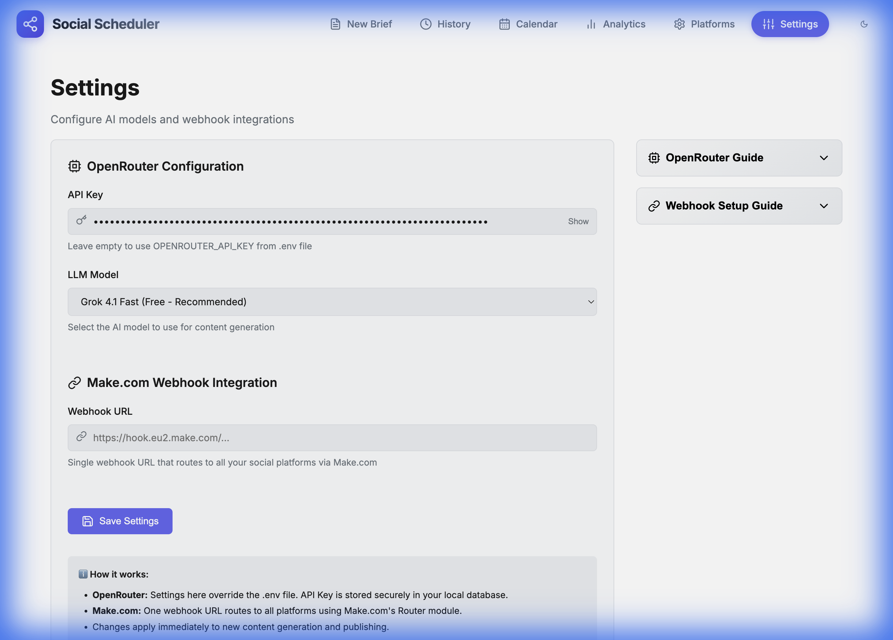

**Expanded Guide:**
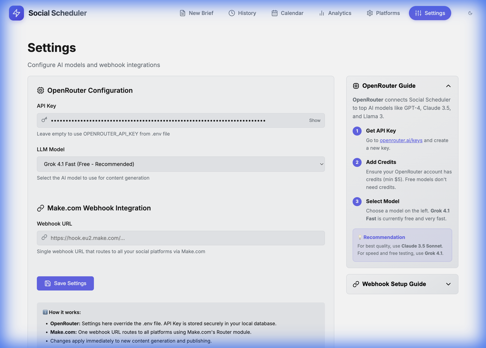

### 3. Test Deep Guide Modal

Navigate to Settings, expand Webhook Setup Guide, and click "Deep Guide":

- [x] **Deep Guide button** replaces "Pro Tip"
- [x] **Modal opens** with full integration guide content
- [x] **Content matches** `docs/MAKE_INTEGRATION_GUIDE.md`
- [x] **Close button** works

**Deep Guide Modal:**
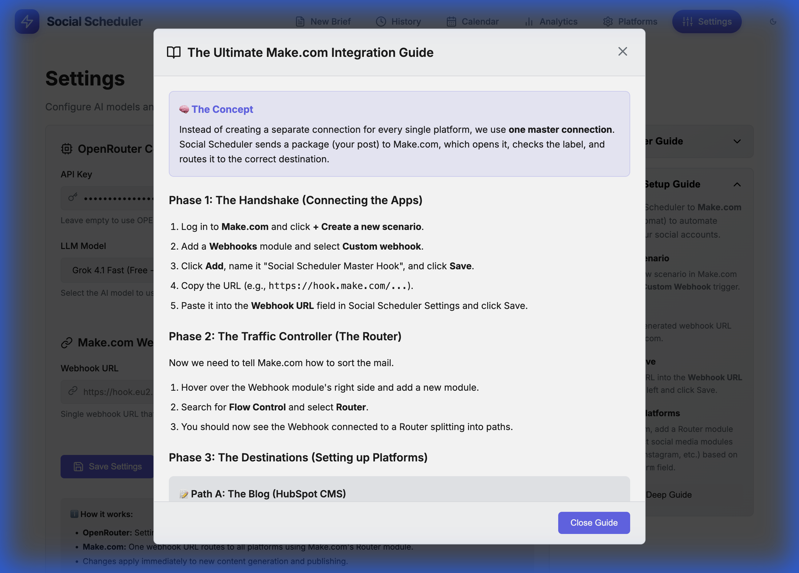

### 4. Test Platforms Page

Navigate to `http://localhost:3000/platforms` and verify:

- [x] **Master Prompt card** displays at top (full width)
- [x] Can **edit and save** Master Prompt
- [x] **Platform cards** no longer show webhook URL fields
- [x] Platform cards still show:
  - Enable/disable toggle
  - Main prompt field
  - Technical prompt field
- [x] **Webhook Setup Guide** is NOT present (moved to Settings)

**Platforms Page - Master Prompt:**
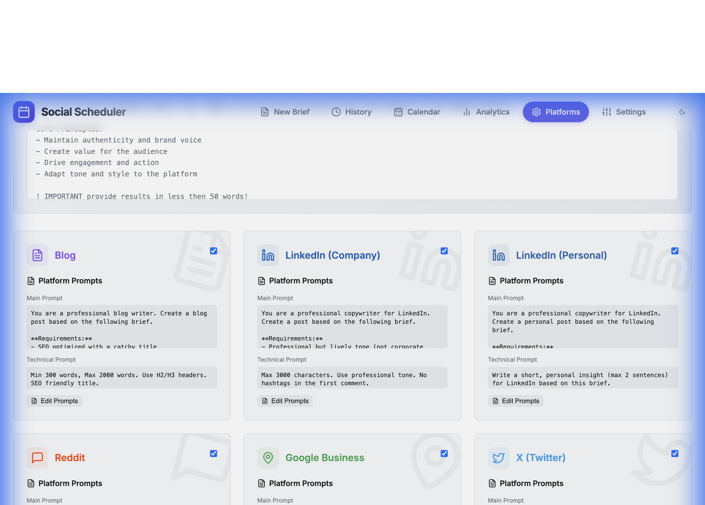

**Platforms Page - Platform Card:**
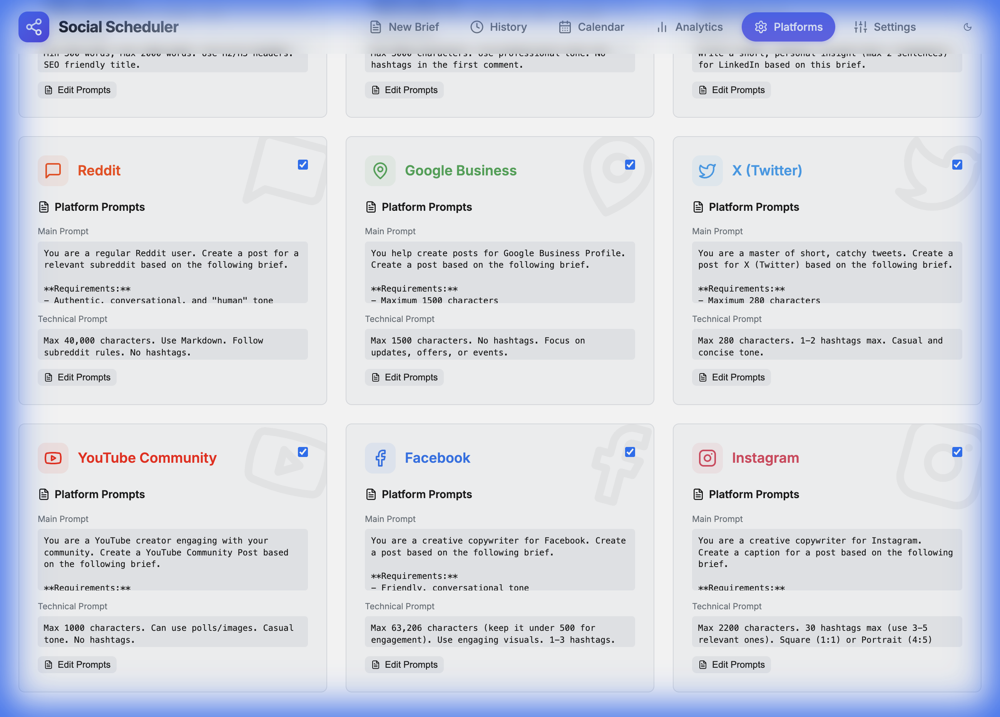

### 4. Test Publishing Flow

1. **Without webhook configured:**
   - Try to publish a post
   - Should see error: *"Make.com webhook URL not configured. Please add it in Settings → Make.com Webhook Integration."*

2. **With webhook configured:**
   -Go to Settings and add a Make.com webhook URL
   - Save the settings
   - Try publishing again
   - Verify the webhook is called with platform data

### 5. Integration Testing

- [ ] Configure Make.com webhook URL in Settings
- [ ] Create a test brief and generate posts
- [ ] Verify publishing works with centralized webhook
- [ ] Check Make.com receives proper payload with `platform` field
- [ ] Test collapsible guides work smoothly (no layout glitches)

---

## Benefits Summary

✅ **Cleaner Architecture** - Single webhook URL for all platforms  
✅ **Better UX** - Organized sections with collapsible guides  
✅ **Logical Organization** - Master Prompt on Platforms (content-related)  
✅ **Easier Maintenance** - Update webhook once, not per-platform  
✅ **Clear Error Messages** - Users know exactly where to configure webhook  
✅ **Reduced Complexity** - Simplified platform cards focus on prompts

---

## Breaking Changes

> [!WARNING]
> **Webhook URL Migration**: Any existing per-platform webhook URLs are no longer used. You need to configure the centralized webhook URL in Settings → Make.com Webhook Integration.

---

## Make.com Setup Reminder

Your Make.com scenario should:
1. Use a **Custom Webhook** trigger
2. Add a **Router** module after the webhook
3. Route based on the `platform` field in the JSON payload
4. Connect platform-specific modules (LinkedIn, Instagram, etc.) on each route

The JSON payload includes:
```json
{
  "platform": "linkedin",
  "content": "...",
  "media_url": "...",
  "media_type": "...",
  "link_url": "...",
  "post_id": 123,
  "timestamp": "2025-11-23T..."
}
```

### 5. Verify Technical Prompt Removal

Navigate to `http://localhost:3000/platforms`, click "Edit Prompt" on any platform:

- [x] **Technical Prompt** section is removed from view mode
- [x] **Technical Prompt** textarea is removed from edit mode
- [x] **Main Prompt** is still editable and saves correctly
### 6. Verify Platforms UI Refactoring

Navigate to `http://localhost:3000/platforms`:

- [x] **"Platform Prompts" H2** header exists before the grid
- [x] **"Platform Prompt" H4** header is removed from individual cards
- [x] UI looks cleaner and less repetitive

**Refactored Platforms UI:**
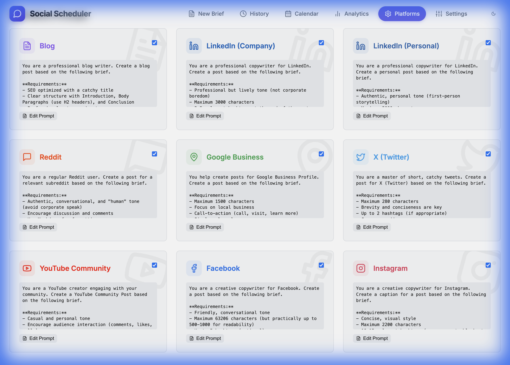
**Edit Mode (No Technical Prompt):**
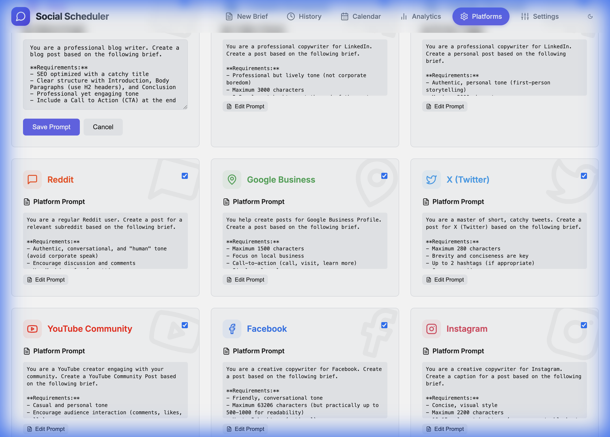

### 7. Verify Master Prompt Guide

Navigate to `http://localhost:3000/platforms`:

- [x] **Master Prompt** and **Prompt Logic Guide** are displayed side-by-side
- [x] **Prompt Logic Guide** expands/collapses correctly
- [x] **Deep Guide** button opens the "How Content is Generated" modal
- [x] Modal content explains the "Ingredients" and "Hierarchy" correctly

**Master Prompt Deep Guide:**
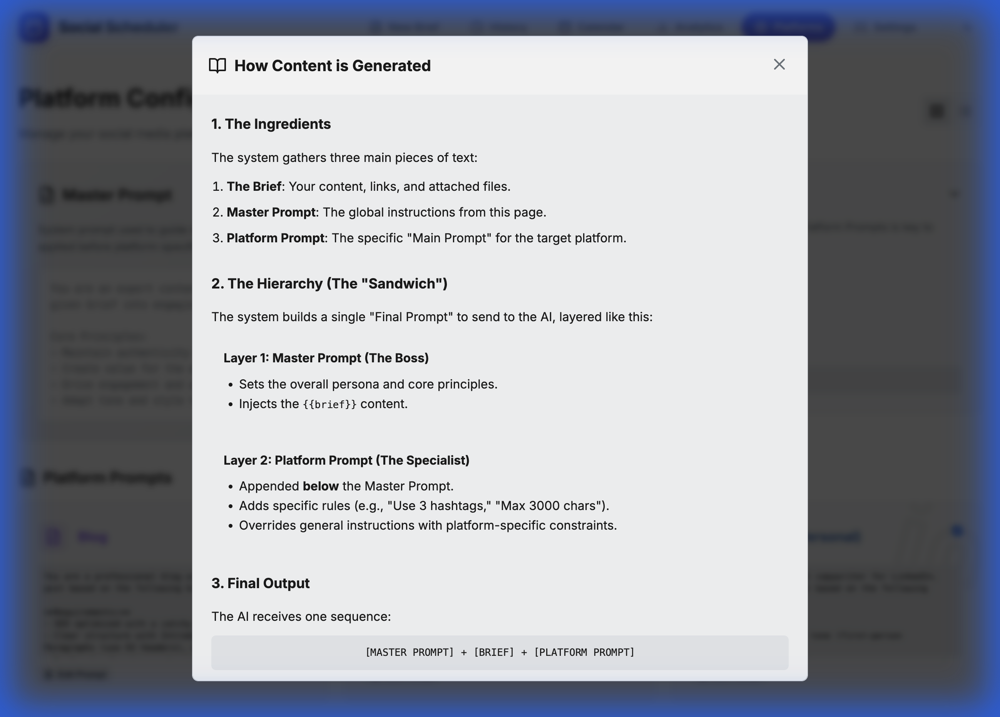

### 8. Verify Platforms Layout Adjustment

Navigate to `http://localhost:3000/platforms`:

- [x] **Master Prompt** section is significantly wider than **Prompt Logic Guide** (2:1 ratio)
- [x] **Platform Cards** are taller (content area height increased by 50%)
- [x] Layout feels more balanced and spacious
### 9. Verify Master Prompt Guide Styling

Navigate to `http://localhost:3000/platforms`:

- [x] **Prompt Logic Guide** card matches the style of Settings guides (gradient background)
- [x] **Deep Guide** modal matches the style of Settings modal (header, footer, padding)

**Styled Deep Guide:**
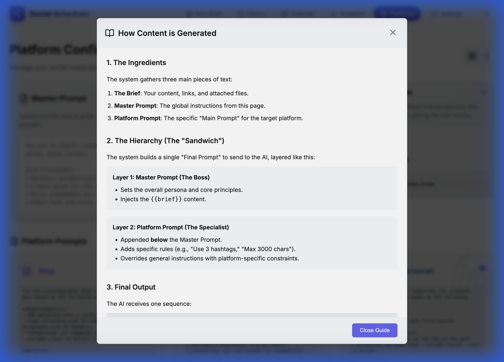

### 10. Verify Platform Prompts Scrolling

Navigate to `http://localhost:3000/platforms`:

- [x] **Platform Prompts** display area is scrollable for long content
- [x] Matches the scrolling behavior of the Master Prompt

**Scrollable Platform Prompts:**
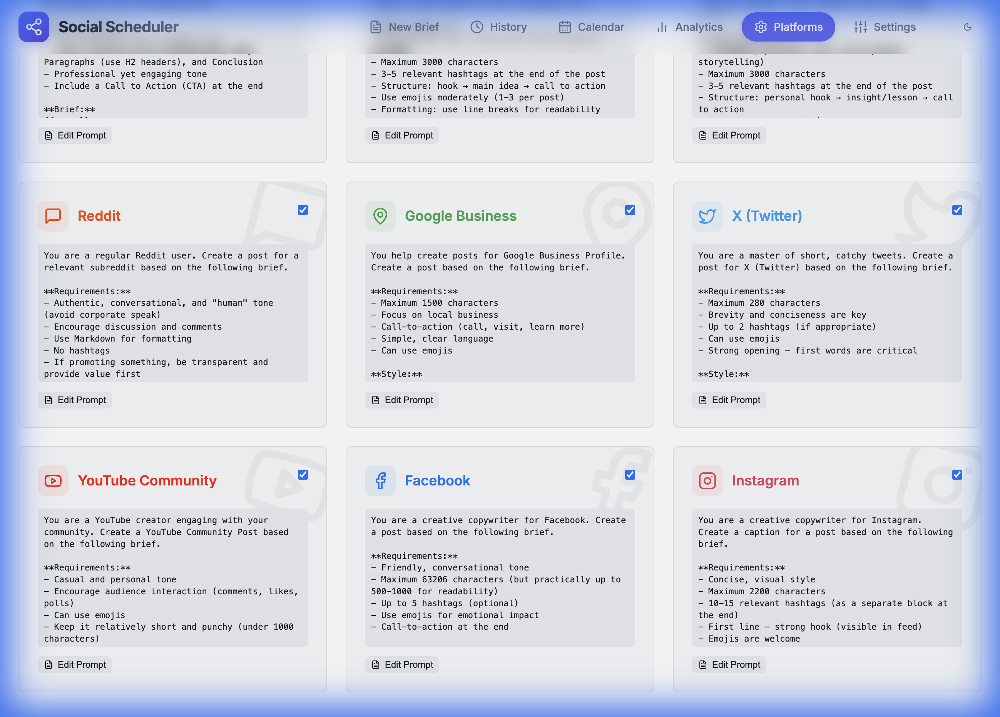
**Adjusted Platforms Layout:**


### 11. Verify CSS Fixes

Navigate to `http://localhost:3000/platforms`:

- [x] **Numbered Steps** in the expanded guide are clearly visible (white text on accent background)
- [x] Correct CSS variable `var(--accent)` is used

**Visible Numbered Steps:**
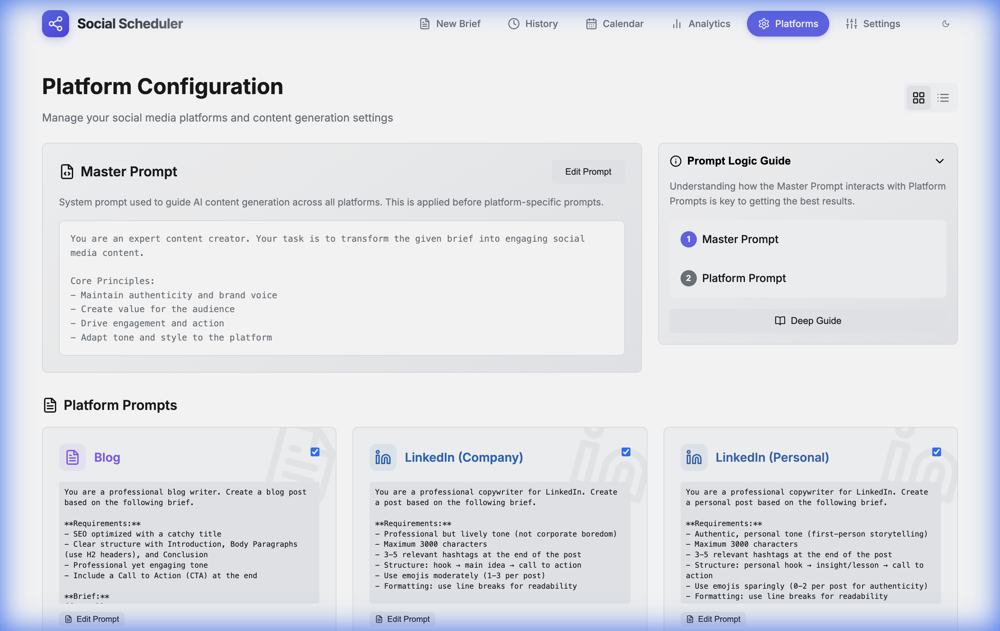

### 12. Verify Final UI Refinements

Navigate to `http://localhost:3000/platforms`:

- [x] **Prompt Logic Guide** width is reduced (approx 30% narrower)
- [x] **Number Circles** (1 and 2) both use the accent color

**Final Guide Layout:**
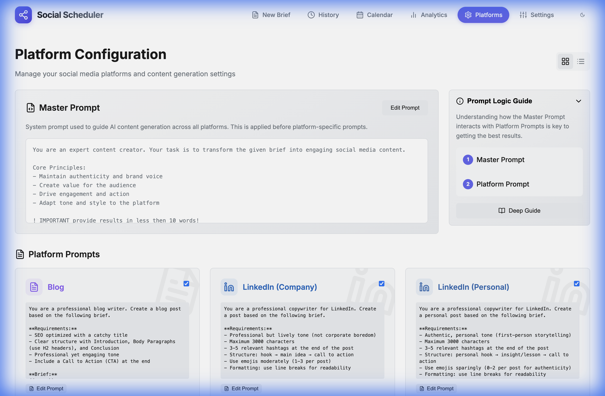
