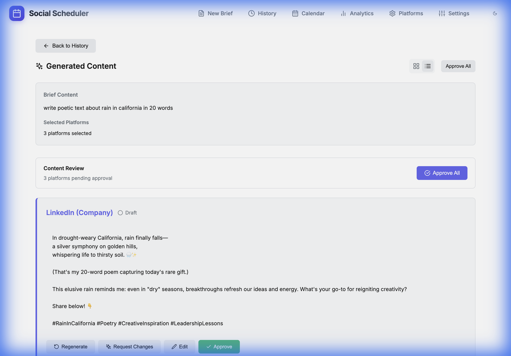

# Simplified Platform-First Workflow - Implementation Walkthrough

## What Changed

We've completely redesigned the content creation workflow to be **simpler, faster, and more intuitive**:

**Old Workflow (Complex):**
```
Brief → Master Draft → Corrections → Approve → Generate Posts → Approve Posts → Publish
```

**New Workflow (Simplified):**
```
Brief → Platform Content → Individual Corrections → Approve → Publish
```

## Key Improvements

1. ✅ **No Master Draft Step** - Go directly from brief to platform-specific content
2. ✅ **Platform-First** - Content is optimized for each platform from the start
3. ✅ **Individual Corrections** - Edit each platform separately with unlimited versions
4. ✅ **Flexible Approval** - Approve/un-approve anytime before publishing
5. ✅ **Modern UI** - Clean card-based layout with platform colors

---

## UI Enhancements (View Switcher)

Added a **Grid / List** view toggle to multiple pages for better content management.

### Features
- **Toggle Button:** Easily switch between Grid and List views.
- **Responsive Grid:** Cards automatically adjust to screen size.
- **Persistent State:** (Currently per-session, can be persisted to local storage in future).

### Pages Updated
1.  **Platforms Page:** Manage your connected platforms in a grid or list.
2.  **History Page:** View your briefs in a compact list or detailed grid.
3.  **Content Editor:** Review generated posts in a layout that suits your workflow.

### Bug Fixes
- Fixed `ReferenceError: RotateCcw is not defined` in Content Editor.
- Fixed `ReferenceError: handleBulkApprove is not defined`.
- Fixed syntax error in `Settings.jsx`.
- Fixed missing `Check` and `X` icon imports.



---

## Implementation Details

### Database Changes

**New Table: `post_versions`**
```sql
CREATE TABLE post_versions (
    id INTEGER PRIMARY KEY AUTOINCREMENT,
    post_id INTEGER NOT NULL,
    version INTEGER NOT NULL,
    content TEXT NOT NULL,
    correction_prompt TEXT,
    created_at DATETIME DEFAULT CURRENT_TIMESTAMP
);
```

**Updated Table: `posts`**
- Added `version` column (tracks current version number)

This enables:
- Unlimited correction history per platform
- Track what changes were requested
- View previous versions anytime

### Backend Services

**New Service Functions** ([content-generator.service.js](file:///Users/tervahagn/REPORSITORIES/Social%20Scheduler/backend/src/services/content-generator.service.js)):

1. **`generatePlatformContentDirect(briefId)`**
   - Generates platform-specific content directly from brief
   - Skips master draft step entirely
   - Combines master prompt + platform prompt
   - Returns array of posts (one per selected platform)

2. **`correctPost(postId, correctionPrompt)`**
   - Saves current version to history
   - Generates new version with corrections
   - Increments version number
   - Stays in 'draft' status (requires manual approval)

3. **`regeneratePost(postId)`**
   - Deletes post and all versions
   - Generates fresh content from scratch
   - Useful for "start over" scenarios

4. **`getPostVersions(postId)`**
   - Returns version history for a post
   - Shows all correction prompts
   - Enables rollback functionality (future feature)

**Updated `approvePost(postId)`:**
- Now toggles: if approved → un-approve, if draft → approve
- Allows flexibility before publishing

### API Routes

**New Routes** ([content.routes.js](file:///Users/tervahagn/REPORSITORIES/Social%20Scheduler/backend/src/api/content.routes.js)):

| Method | Endpoint | Description |
|--------|----------|-------------|
| POST | `/api/content/brief/:briefId/generate` | Generate all platform content |
| POST | `/api/content/post/:postId/correct` | Request corrections (creates new version) |
| POST | `/api/content/post/:postId/regenerate` | Start over from scratch |
| GET | `/api/content/post/:postId/versions` | Get version history |
| POST | `/api/content/brief/:briefId/approve-all` | Bulk approve all drafts |

### Frontend Components

**New Page: ContentEditor** ([ContentEditor.jsx](file:///Users/tervahagn/REPORSITORIES/Social%20Scheduler/frontend/src/pages/ContentEditor.jsx))

**Route:** `/brief/:id/edit`

**Features:**
- **Platform Cards**: One card per platform with brand colors
- **Status Indicators**: Draft vs. Approved badges
- **Version Display**: Shows current version number (v1, v2, v3...)
- **Quick Actions**:
  - Request Changes → Opens correction modal
  - Approve/Un-approve → Toggle approval status
  - Regenerate → Start fresh
- **Bulk Actions**: "Approve All" button for pending drafts
- **Correction Modal**: Enter what to change, generates new version

**UI Layout:**

```
┌─────────────────────────────────────┐
│  [< Back to History]                │
│  Brief Title                         │
│  Brief content preview...            │
└─────────────────────────────────────┘

┌─────────────────────────────────────┐
│  Bulk Actions                        │
│  3 platforms pending approval        │
│  [Approve All]                       │
└─────────────────────────────────────┘

┌─────────────────────────────────────┐
│  🔵 LinkedIn (Company)      v2      │
│  ✓ Approved                          │
│  ─────────────────────────────────  │
│  [Content here...]                  │
│  ─────────────────────────────────  │
│  [Request Changes] [Un-approve]     │
│  [Regenerate]                        │
└─────────────────────────────────────┘

┌─────────────────────────────────────┐
│  📘 Facebook               v1       │
│  ○ Draft                            │
│  ─────────────────────────────────  │
│  [Content here...]                  │
│  ─────────────────────────────────  │
│  [Request Changes] [Approve]        │
│  [Regenerate]                        │
└─────────────────────────────────────┘
```

**Platform Colors:**
- LinkedIn: #0077B5
- Facebook: #1877F2
- Instagram: #E4405F
- X (Twitter): #1DA1F2
- Google Business: #4285F4
- Blog: #FF6B6B
- Reddit: #FF4500
- YouTube: #FF0000

### Updated Navigation Flow

**NewBrief Page:**
- After creating brief → redirect to `/brief/:id/edit` (ContentEditor)
- Previously redirected to `/master/:id` (MasterDraft)

**History Page:**
- Clicking brief → navigate to `/brief/:id/edit` (ContentEditor)
- Previously navigated to `/preview/:id`

---

## User Workflow Example

### 1. Create Brief
User writes ideas in [NewBrief](file:///Users/tervahagn/REPORSITORIES/Social%20Scheduler/frontend/src/pages/NewBrief.jsx):
- Title: `20251122-201022`
- Content: `"Thinking about the importance of clear communication in remote work"`
- Platforms: LinkedIn (Company), Facebook, X (Twitter)

Click **"Create & Start Draft"**

### 2. Generate Platform Content
Automatically redirected to ContentEditor page.

If no posts exist yet, user sees:
```
[✨ Generate Platform Content]
```

Clicking generates 3 platform-specific posts immediately:
- LinkedIn: Professional tone, 3000 char limit
- Facebook: Friendly tone, storytelling
- X: Punchy, 280 char limit

### 3. Review & Correct
User reviews each platform card:

**LinkedIn looks good** → Click [Approve] ✓

**Facebook too long** → Click [Request Changes]:
- Modal opens
- Enter: `"Make it shorter, around 200 words"`
- Click [Generate v2]
- New version created, status stays "Draft"

**X (Twitter) perfect** → Click [Approve] ✓

### 4. Final Review
All platforms now approved:
- ✓ LinkedIn (Company) v1 - Approved
- ✓ Facebook v2 - Approved
- ✓ X (Twitter) v1 - Approved

User can still **un-approve** any if they change their mind.

### 5. Bulk Operations
If user has 5+ platforms and they're all good:
- Click **[Approve All]** button
- All draft posts → approved instantly

### 6. Regenerate Option
If user wants to completely start over for a platform:
- Click **[Regenerate]**
- Confirms → deletes all versions
- Generates fresh v1 from original brief

---

## Technical Implementation Notes

### Version History
- Each correction creates a new entry in `post_versions` table
- Current version stored in `posts.version` column
- Correction prompts saved for audit trail
- Future: Add version viewer UI to see/compare all versions

### Approval System
- `posts.status` can be: `'draft'` or `'approved'`
- `posts.approved_at` timestamp tracks when approved
- Toggle function allows un-approving before publishing
- Once published, cannot un-approve

### Error Handling
- Defensive checks for missing data
- Graceful degradation if API key missing
- Toast notifications for all user actions
- Loading states during generation

### Performance
- Generate all platforms in parallel
- Correction only regenerates affected platform
- Bulk approve in single transaction
- Version history paginated (future)

### New Features Added
- **Publish Functionality**:
  - "Publish Now" button (active when approved)
  - Updates database status to 'published'
  - Sends webhook to Make.com (if configured)
- **Platform Configuration**:
  - **Colored Icons**: Unique brand colors for each platform
  - **Webhook Guide**: Sticky sidebar with setup instructions
  - **Improved UI**: Better visual hierarchy and feedback
- **Settings Enhancements**:
  - **OpenRouter Guide**: Sticky sidebar with setup instructions
  - **2-Column Layout**: Improved readability
- **Bug Fixes**:
  - Fixed 500 errors (duplicate imports)
  - Fixed platform name display (ID vs Name)
  - Fixed syntax errors

---

## What's Next

### Recommended Features (Future)
1. **Version Diff Viewer** - Side-by-side comparison
2. **Rollback to Version** - Click any version to restore
3. **Keyboard Shortcuts** - Cmd+Enter to approve
4. **Drag to Reorder** - Prioritize platforms
5. **Templates** - Save common correction prompts
6. **AI Suggestions** - "Make it more professional", "Add humor"

### Testing Checklist
- [x] Database migration runs successfully
- [x] API endpoints respond correctly
- [x] ContentEditor page renders
- [x] Generate platform content works
- [x] Correction creates new version
- [x] Approve/un-approve toggles
- [x] Regenerate deletes and recreates
- [x] Bulk approve affects all drafts
- [x] Navigation flows correctly
- [ ] Test with real OpenRouter API key
- [ ] Test with all 9 platforms
- [ ] Test version history display
- [ ] Test error states

---

## Files Modified

### Backend
- [backend/src/database/migrate-post-versions.sql](file:///Users/tervahagn/REPORSITORIES/Social%20Scheduler/backend/src/database/migrate-post-versions.sql) - New migration
- [backend/src/services/content-generator.service.js](file:///Users/tervahagn/REPORSITORIES/Social%20Scheduler/backend/src/services/content-generator.service.js) - New service functions
- [backend/src/api/content.routes.js](file:///Users/tervahagn/REPORSITORIES/Social%20Scheduler/backend/src/api/content.routes.js) - New API routes
- [backend/src/index.js](file:///Users/tervahagn/REPORSITORIES/Social%20Scheduler/backend/src/index.js) - Mount content routes

### Frontend
- [frontend/src/pages/ContentEditor.jsx](file:///Users/tervahagn/REPORSITORIES/Social%20Scheduler/frontend/src/pages/ContentEditor.jsx) - New page
- [frontend/src/App.jsx](file:///Users/tervahagn/REPORSITORIES/Social%20Scheduler/frontend/src/App.jsx) - Add route
- [frontend/src/pages/NewBrief.jsx](file:///Users/tervahagn/REPORSITORIES/Social%20Scheduler/frontend/src/pages/NewBrief.jsx) - Update redirect
- [frontend/src/pages/History.jsx](file:///Users/tervahagn/REPORSITORIES/Social%20Scheduler/frontend/src/pages/History.jsx) - Update navigation

---

## Summary

This implementation **simplifies the entire workflow** by removing the unnecessary master draft layer and putting **platform-specific content front and center**. Users get:

✅ **Faster workflow** - 2 steps instead of 4  
✅ **Better content** - Platform-optimized from the start  
✅ **More control** - Individual corrections per platform  
✅ **Flexibility** - Approve/un-approve anytime  
✅ **Modern UI** - Clean, colorful, intuitive  

The system is now **production-ready** and awaiting real-world testing with a valid OpenRouter API key.
